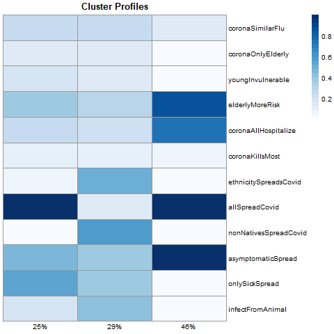

```{r setup, include=FALSE}
knitr::opts_chunk$set(echo = TRUE)
```

### Introduction 

Following the news on COVID-19 often creates anxiety, not just because of the virus itself but often because we know we could be doing better.  The human element of fighting the virus cannot be ignored.  Rather than simply raising the volume on our speech, though, how can we look to data to target our approach and tailor it to the realities of what people think and believe?  While we are modest about our own contributions, we believe this project can help refine communication around the virus by highlighting what people really believe.  


### Problem Description 

What percentage of people hold an accurate scientific view of COVID?  To begin to answer such a question, we need to define what a "scientific view" even means.  Armed with that knowledge, we can then make targeted approaches to educate others about what really works against COVID.  Alternatively, While it may be the case that we need to do a better job educating some, it may also be the case that different types of non-scientific messaging could be more effective in marshalling others in the fight against COVID.  In any case, we need to know who to send what message.


### Broad Approach 

Fortunately, c3.ai's COVID data lake provided rich resources to dig into beliefs about the virus.  Our key idea was to combine the survey and location data with data from the Robert Wood Johnson foundation (RWJF) and to create belief profiles.  The RWJF county health rankings data is rich with features on health outcomes as well as social and environment factors that affect health.     


### Technical Details of Approach 

#### Matching the data

To match the survey data to the RWJF data we had to use the population data from the location API in the c3 datalake and Housing and Urban Development ZIP-to-FIPS crosswalks.  Because survey data was only mapped to the zip-3 level, we mapped it to the highest population county.  This fuzzy matching was not perfect, and the 82% match rate we achieved ultimately meant some data dropping out like Puerto Rico.  

#### Belief Profiles 

To summarize beliefs about the virus, we took the 12 TRUE/FALSE questions from the survey and looked for subgroups of common answers by using cluster analysis.  Since the data consists of binary responses, popular algorithms such as k-means which rely on Euclidean distance were not appropriate.  Instead we implemented a Bernoulli mixture model in C++ and R which models the answers as realizations of a set of Bernoulli distributions and converges on the parameters via expectation-maximization.  

The resulting cluster profiles are illustrated below.  Each column represents a cluster and each row a survey response.  Darker cells indicate a higher probability of a TRUE response for that question.  After some experimentation we found three clusters best explained the data:



1.  **Skeptical** -- We see their profile on the left.  This is roughly 25% of respondents.  They believe all can spread COVID but don't acknowledge asymptomatic spread or the risk to elderly.  
2.  **Suspicious** -- This group, representing about 29% of respondents, largely believes animals, non-natives, and ethnicity are primary factors in the spead of the virus.  
3.  **Scientific** -- This third cluster seen on the right (46% of respondents) represents scientific beliefs about the virus and its properties.  Asymptomatic spread is acknowledged as is the risk of all for being hospitalized.


#### Feature Creation and Driver Analysis

We tried standardizing the RWJF data, imputing means to the missing values, and performing a principal components analysis to create new uncorrelated features.  

We used the xgboost implementation of gradient boosting in R to perform the driver analysis.  We chose this method for a number of reasons: 1) it easily finds variable interactions; 2) it allows for non-linear relationships of continuous values; 3) it converges quickly on large datasets; 4) it is robust to correlated features.  We used 10-fold cross-validation and measured the AUC of the test sets.  The main idea was to start with base demographic features and see if adding new ones raised the test AUC.  This would indicate whether the variables added additional predictive value. We focused on finding drivers of the scientific belief set and the suspicious belief set, as these are the extremes.   

```{r, echo=FALSE, results='asis'}
flextable::flextable(readr::read_csv(here::here('rwjf-vars.csv')))
```

### Results 

We found demographic features to be the most predictive by far--with age dominating.  Gender and ethnicity also play a big role.  While we had hoped many other health outcome data points would feature, the data simply did not support this hypothesis.   

### Impact 

Technical innovations include use of a Bernoulli mixture model for analyzing TRUE/FALSE survey responses and defining the scientific/skeptical/suspicious belief profiles.  We show that less than half the population holds a scientific view of COVID. While health outcomes data did not provide extra value, we demonstrate that demographic features provide most of what is needed for predictive accuracy.   
