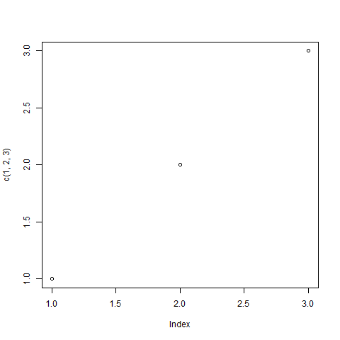

```{r setup, include=FALSE}
knitr::opts_chunk$set(echo = TRUE)
```

### Introduction (100 words)


### Problem Description (100 words)


### Broad Approach (97/200 words)

Rather than focusing on the biological and medical aspects of the virus, we wanted to investigate the attitudes and beliefs around COVID, as it represents a great opportunity area for fighting the virus--convincing others to do what we already know works.  Fortunately, c3.ai's COVID data lake provided rich resources to do so.  Our key idea was to combine the survey and location data with data from the Robert Wood Johnson foundation (RWJF).  The RWJF county health rankings data is rich with features on health outcomes as well as social and environment factors that affect health.     


### Technical Details of Approach (220/400 words)

To summarize beliefs about the virus, we took the 12 TRUE/FALSE questions from the survey and looked for subgroups of common answers by using cluster analysis.  Since the data consists of binary responses, popular algorithms such as k-means which rely on Euclidean distance were not appropriate.  Instead we implemented a Bernoulli mixture model in C++ and R which models the answers as realizations of a set of Bernoulli distributions and converges on the parameters via expectation-maximization.  

The resulting cluster profiles are illustrated below.  Each column represents a cluster and each row a survey response.  Darker cells indicate a higher probability of a TRUE response for that question.  After some experimentation we found three clusters best explained the data:



1.  **Skeptical** -- We see their profile on the left.  This is roughly 25% of respondents.  They believe all can spread COVID but don't acknowledge asymptomatic spread or the risk to elderly.  
2.  **Suspicious** -- This group, representing about 29% of respondents, largely believes animals, non-natives, and ethnicity are primary factors in the spead of the virus.  
3.  **Scientific** -- This third cluster seen on the right (46% of respondents) represents scientific beliefs about the virus and its properties.  Asymptomatic spread is acknowledged as is the risk of all for being hospitalized.


But what is behind these attitudes and beliefs?  


### Results (100 words)


### Impact (100 words)

